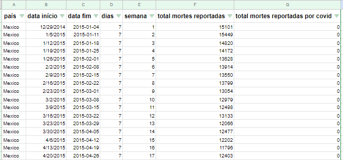
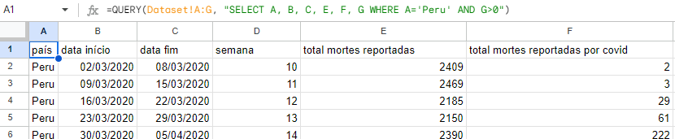
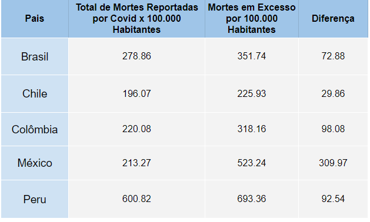
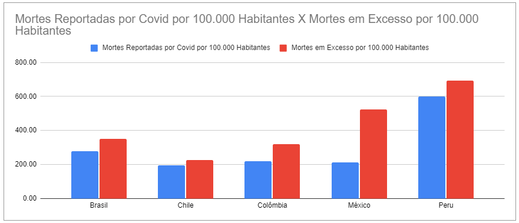
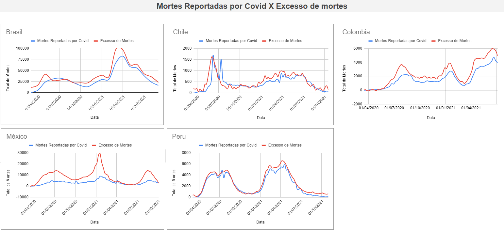
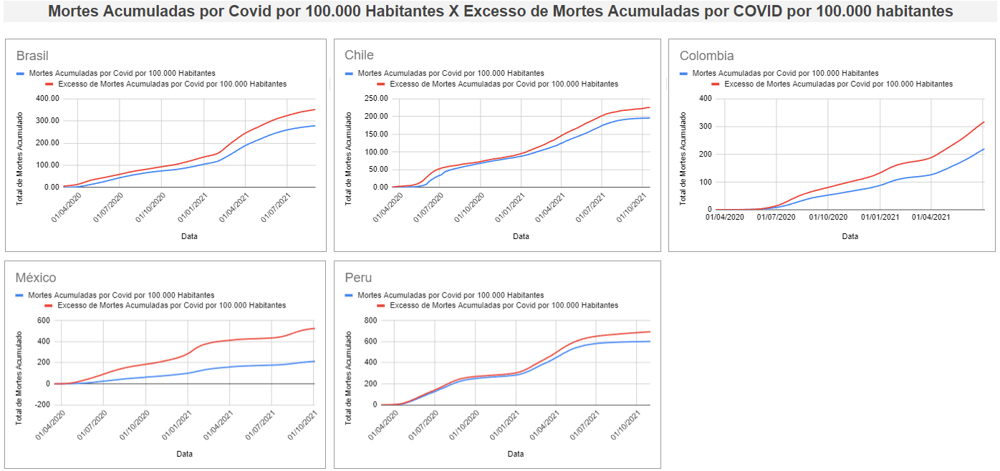

# Análise do Impacto da COVID-19 na Mortalidade na América Latina através do Excesso de Mortes por 100.000 Habitantes


## Descrição do Problema:

O projeto visa entender e comparar o impacto da COVID-19 na mortalidade em países da América Latina, utilizando o indicador de "excesso de mortes" por 100.000 habitantes. A abordagem busca superar as limitações dos números oficiais de mortes por COVID-19, que podem ser subestimados devido a vários fatores, como falta de testagem, atrasos nos registros e impactos indiretos na saúde.

## Objetivos do Projeto:
- Calcular o "excesso de mortes" atribuído à COVID-19 em diferentes países da América Latina.
- Normalizar os dados, calculando o "excesso de mortes" por 100.000 habitantes para permitir comparações significativas.
- Comparar e classificar os países com base no impacto relativo da COVID-19 na mortalidade, utilizando o indicador ajustado.
- Investigar padrões temporais e geográficos nas tendências de excesso de mortes ao longo do tempo.

## Perguntas

Ao final do projeto espera-se que possamos responder as seguintes perguntas:

*Considerando os valores por 100.000 habitantes, em que país há a maior diferença entre os óbitos oficiais de COVID notificados e os excedentes estimados de óbitos?*

*Considerando os valores por 100.000 habitantes, em que país existe a menor diferença entre os óbitos oficiais por COVID notificados e os excedentes estimados de óbitos?*

*Considerando os valores por 100.000 habitantes, qual é o país com o maior número de óbitos excedentes?*

## Métodos
- **Coleta de dados:** Obter dados de mortalidade por todas as causas em diferentes países da América Latina ao longo do período da pandemia.
- **Estabelecimento da linha de base histórica:** Calcular médias históricas de mortes por todas as causas nos anos pré-pandêmicos para estimar o que seria esperado na ausência da COVID-19.
- **Cálculo do "excesso de mortes":** Subtrair as mortes observadas das mortes esperadas para determinar o impacto adicional atribuível à COVID-19.
- **Normalização:** Calcular o "excesso de mortes" por 100.000 habitantes para cada país.
- **Análise comparativa:** Comparar os resultados entre os países para identificar variações e padrões.

## Dataset

Os dados usados contêm informações sobre o total de mortes e sobre as mortes relatadas por COVID-19 nos países do México, Peru, Chile, Colômbia e Brasil. O conjunto de dados está armazenado em uma planilha do Google com a seguinte estrutura:

1.332 linhas, cada linha representa o acumulado por semana ou mês do total de mortes e das mortes causadas por COVID-19. 




- **país:** nome do país (podem ser: México, Peru, Chile, Brasil e Colômbia).
- **data de início:** data de início do intervalo de contagem de mortes.
- **data de término:** data de término do intervalo de contagem de mortes.
- **dias:** número de dias da contagem de óbitos. No caso do Chile, Peru, Colômbia e México é uma semana (7 dias). Para o Brasil, os dados são acumulados mensalmente (28, 30 e 31 dias).
- **semana:** número da semana ou mês do ano.
- **total de mortes relatadas:** é o total de óbitos notificados por qualquer causa (não apenas COVID-19) no intervalo de datas estabelecido (óbitos em uma semana ou mês).
- **total de mortes relatadas por COVID-19:** é o total de óbitos notificados causados por COVID-19 no intervalo de datas estabelecido (óbitos em uma semana ou mês).

### Compreenção do dataset 


A primeira linha mostra o número de mortes no México de 29/12/2014 a 04/01/2015 (7 dias). Esse intervalo de datas representa a semana 1 de 2015, e nessas datas foram repostadas 15.101 mortes no total e zero mortes causadas por COVID-19. Faz sentido, visto que a COVID-19 teve inicio em 2020.

A última linha mostra o número de mortes no Brasil no intervalo de 01/09/2021 a 30/09/2021 (30 dias) com um total de 129.743 mortes e 16.336 mortes reportadas por COVID.

Cada linha contém o acumulado por semana ou mês do número total de mortes e o número de mortes causadas por COVID-19 nos 5 países.

## Análise do Dados

As etapas a seguir foram realizadas 5 vezes ao todo, uma para cada país.

### Etapa 1: Cálculo de Mortes por 100.000 Habitantes:
A. Utilizamos a função QUERY para filtrar dados específicos de cada país em uma planilha separada.
   
**Exemplo (Peru):**
```
=QUERY(DADOS!A:G, "SELECT A, B, C, E, F, G WHERE A='Peru' AND B>= date '2020-03-02'")
```
**Resultado:** Uma aba nova apenas com dados do páis específico.




B. Criamos uma nova coluna para calcular as mortes por 100.000 habitantes, usando a população obtida pela função PROCV/VLOOKUP.

Formula Matemática:

    (Número de Mortes * 100.000) / População Total do País

**Formula:**
```
=(F2*100000/VLOOKUP(A2,'População'!A:B,2,false))
```

### Etapa 2: Cálculo do Total Acumulado de Mortes por 100.000 Habitantes:
Adicionamos uma coluna com o número acumulado de óbitos por data, somando os óbitos do periodos anterior com os do periodo mais recente, para as mortes gerais e também por covid-19.


### Etapa 3: Cálculo do Prognóstico de Mortes usando Médias Simples:
Utilizamos a função MÉDIA.SE.S/AVERAGEIFS para calcular a previsão de mortes.

**Exemplo:**
```
=IFERROR(AVERAGEIFS(DADOS!F:F, DADOS!A:A, "=Peru", DADOS!G:G, "=0", DADOS!E:E, D2), I1)
```

### Etapa 4: Cálculo do Excesso de Mortes por COVID:
Subtraímos o número total de mortes notificadas pelo prognóstico de mortes.

**Formula:**

    Total de Mortes por Covid19 no Periodo - Estimativa de Mortes

### Etapa 5: Cálculo do Excesso de Mortes por COVID por 100.000 Habitantes:
Convertemos os números de mortes para valores por 100.000 habitantes, criando uma nova coluna e aplicando a fórmula correspondente.
Formula
$Excesso de Mortes * 100.000 / População do País$

### Etapa 6: Cálculo do Excesso de Mortes por COVID-19 por 100.000 Habitantes Acumuladas:
Similar ao cálculo acumulado de mortes, criaremos uma coluna para o excesso de mortes acumuladas por 100.000 habitantes.

## Visualizações

Com as análises feitas anteriomente foi possível gerar:

    Uma tabela comparativa com o total de mortes por COVID-19 notificadas por 100 mil habitantes, o total de mortes em excesso por 100 mil habitantes e a diferença entre os dois valores, por país:



    E um gráfico de barras que apresenta a comparação entre total de mortes por COVID-19 notificadas por 100 mil habitantes e o total de mortes em excesso por 100 mil habitantes:



    Visualização em gráfico para cada páis do Mortes reportadas por Covid-19 X Excesso de Mortes ao longo das semanas dos anos de 2020 e 2021:



    Visualização em gráfico para cada páis do Mortes reportadas por Covid-19 X Excesso de Mortes, com valores acumulados ao longo das semanas dos anos de 2020 e 2021:



## 💡 Resultados

Com as informações extraídas da base de dados podemos cocluir o seguinte:

1. Maior Diferença entre Óbitos Oficiais e Excedentes - México

    O México destaca-se como o país onde ocorreu a maior diferença entre os óbitos oficiais de COVID-19 notificados e os excedentes estimados de óbitos por 100.000 habitantes. Isso sugere que pode haver uma subnotificação significativa ou outros fatores impactando a contagem oficial de óbitos.

2. Menor Diferença entre Óbitos Oficiais e Excedentes - Chile

    O Chile apresenta a menor diferença entre os óbitos oficiais por COVID-19 notificados e os excedentes estimados de óbitos por 100.000 habitantes. Isso pode indicar um maior nível de precisão ou confiabilidade nos números oficiais de óbitos, comparativamente a outros países analisados.

3. Maior Número de Óbitos Excedentes - Peru

    O Peru destaca-se como o país onde ocorreu o maior número de óbitos excedentes por 100.000 habitantes. Isso sugere que, além dos óbitos oficialmente atribuídos à COVID-19, há um número significativo de mortes adicionais que podem estar relacionadas à pandemia, mas não foram contabilizadas diretamente como tal.

Esses resultados proporcionam insights valiosos sobre a disparidade nos números de óbitos oficiais e estimados, apontando para áreas que exigem atenção e investigação mais detalhada. Este resumo contribui para a compreensão global do impacto da pandemia na região, destacando não apenas os números oficiais, mas também considerando a realidade dos óbitos excedentes.


### Os resultados podem ser visualizados no seguinte relatório: [Análise das mortes por Covid-19 em países da América Latina](https://docs.google.com/spreadsheets/d/1yBOSTk6jpdjkvEndQRCAgj81SnJ_q-6PYMokf9dpUAk/edit?usp=sharing)

## Conclusões e Recomendações

A variação nos números de óbitos excedentes destaca a importância de considerar não apenas as estatísticas oficiais de COVID-19, mas também outras métricas para obter uma compreensão mais abrangente do impacto real da pandemia.

- Necessidade de Revisão nos Métodos de Contagem: As diferenças observadas enfatizam a importância de revisar e melhorar os métodos de contagem de óbitos, garantindo uma representação mais precisa da situação.
Monitoramento Contínuo:

- Recomenda-se um monitoramento contínuo e análises adicionais para compreender melhor as dinâmicas em jogo e informar políticas de saúde pública.