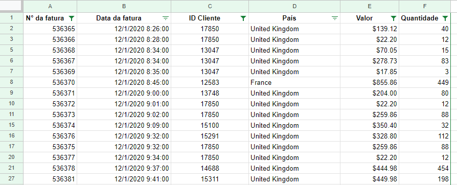

# Segmentação e Retenção de Clientes de um E-commerce

## Descrição do Problema:

A UK Merch, uma empresa de varejo de vestuário no atacado, enfrenta desafios significativos em entender e otimizar seu desempenho de negócios. A falta de dados e estratégias claras impacta diretamente suas operações e decisões. Os principais problemas identificados são:

**Falta de Visibilidade nas Vendas:** A empresa não possui uma compreensão clara de suas métricas de vendas mensais, padrões sazonais, e os países que contribuem significativamente para o volume de vendas.

**Ausência de Estratégias Segmentadas:** A UK Merch adota uma abordagem única para todos os clientes, sem segmentação efetiva. Isso resulta em gastos ineficientes de recursos e esforços de marketing.

**Dificuldade em Medir a Retenção de Clientes:** A falta de métricas claras para medir a retenção de clientes dificulta a avaliação do impacto da expansão para outros países.

**Uso Ineficiente de Recursos:** Suspeita-se que a empresa esteja gastando recursos de maneira inadequada, sem foco estratégico. Isso pode ser otimizado para maximizar os lucros.

## Objetivos

### Revisão da Qualidade dos Dados:

Identificar e corrigir problemas de qualidade nos dados, como ausências, duplicatas e valores inconsistentes.

### Análise Descritiva de Vendas:

Construir um dashboard que forneça uma visão abrangente das métricas de negócios, incluindo vendas mensais, países de destaque, clientes principais e padrões de compra.

### Análise de Coorte para Medir Retenção:

Aplicar análise de coorte para medir a retenção de clientes, distinguindo entre clientes do Reino Unido e internacionais.

### Segmentação de Clientes com Metodologia RFM:

Utilizar a abordagem RFM para segmentar clientes com base em Recência, Frequência e Quantidade, identificando grupos estratégicos.

## Limpeza e preparação dos dados

## Análise exploratoria

### Análise das Vendas

### Medição do Engajamento do Cliente com Análise de Coorte

### Segmentação de Clientes com Metodologia RFM

## 💡 Resultados

## 📊 Visualização

Os resultados podem ser visualizados no seguinte relatório: [Análise das mortes por Covid-19 em países da América Latina](https://lookerstudio.google.com/reporting/0a84786a-7bc8-4e28-99ed-a0032aabafa1)