# Projeto de Otimização Estratégica na UK Merch: Integrando Análise de Dados para Potencializar Vendas, Retenção de Clientes e Eficiência Operacional


## Descrição do Problema:

A UK Merch, uma empresa de varejo de vestuário no atacado, enfrenta desafios significativos em entender e otimizar seu desempenho de negócios. A falta de dados e estratégias claras impacta diretamente suas operações e decisões. Os principais problemas identificados são:

**Falta de Visibilidade nas Vendas:** A empresa não possui uma compreensão clara de suas métricas de vendas mensais, padrões sazonais, e os países que contribuem significativamente para o volume de vendas.

**Ausência de Estratégias Segmentadas:** A UK Merch adota uma abordagem única para todos os clientes, sem segmentação efetiva. Isso resulta em gastos ineficientes de recursos e esforços de marketing.

**Dificuldade em Medir a Retenção de Clientes:** A falta de métricas claras para medir a retenção de clientes dificulta a avaliação do impacto da expansão para outros países.

**Uso Ineficiente de Recursos:** Suspeita-se que a empresa esteja gastando recursos de maneira inadequada, sem foco estratégico. Isso pode ser otimizado para maximizar os lucros.

## Objetivos

- ### Revisão da Qualidade dos Dados:

Identificar e corrigir problemas de qualidade nos dados, como ausências, duplicatas e valores inconsistentes.

- ### Análise Descritiva de Vendas:

Construir um dashboard que forneça uma visão abrangente das métricas de negócios, incluindo vendas mensais, países de destaque, clientes principais e padrões de compra.

- ### Análise de Coorte para Medir Retenção:

Aplicar análise de coorte para medir a retenção de clientes, distinguindo entre clientes do Reino Unido e internacionais.

- ### Segmentação de Clientes com Metodologia RFM:

Utilizar a abordagem RFM para segmentar clientes com base em Recência, Frequência e Quantidade, identificando grupos estratégicos.

## Limpeza e preparação dos dados

### Detecção de nulos ou vazios

Uma forma rápida de diagnosticar se o conjunto de dados possui valores vazios é utilizar a função “=CONTAR.VAZIO()” ou "=COUNTBLANK()". Esta função percorre cada valor do intervalo e conta o número de registros vazios encontrados.

Para esse projeto os registros com valores nulos foram deletados pois eram poucos significativos para a análise.

### Detecção e remoção de dados duplicados

Para remover dados duplicados, usamos a função Remover cópias (Dados > Limpeza de dados > Remover cópias). Com foco em na coluna fatura pois elá é o idendifcador e deve ser único em cada registro de venda.


### Detecção e eliminação de quantidades negativas

Existem valores negativos mas nesse caso não são necessariamente incorretos. Pois nos registros das vendas as faturas que começam com a letra C correspondem a devoluções e podemos assumir que a isso se devem os valores negativos (a venda é positiva, a devolução é negativa).


Como só queremos analisar as vendas do negócio (e não as devoluções), devemos remover esses valores do nosso conjunto de dados. Para isso, você pode usar filtros, em particular a opção **"Filtrar por condição"**, e depois remover as linhas com valores negativos.


## Análise exploratoria

### Análise das Vendas

**Análise do Número de Faturas por País:**

- Criamos uma tabela que listou o número de faturas emitidas para cada país.

    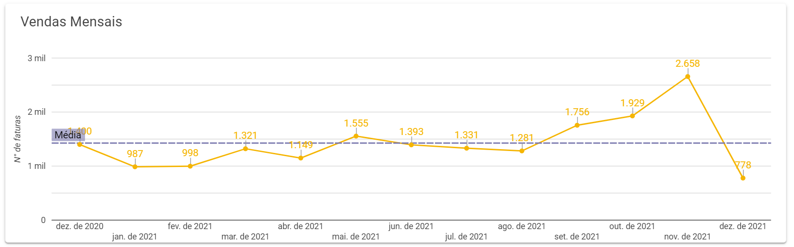

- Calculamos a porcentagem de faturas representada por cada país.

    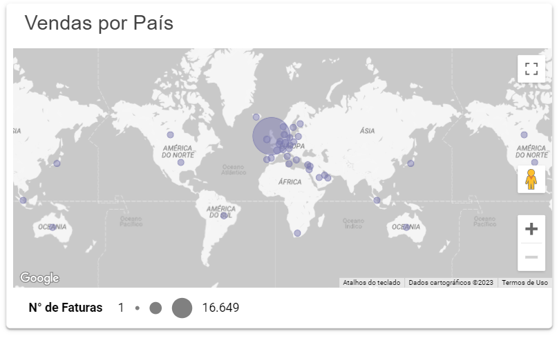

Com isso identificamos os principais países em termos de número de faturas emitidas.


**Análise de Valor Total por País:**

- Criamos uma tabela que apresentou o valor total de vendas por país.

    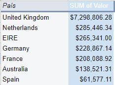

- Calculamos a porcentagem que cada país representou do valor total.

    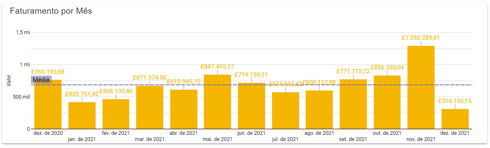

- Calculamos o valor médio, mínimo e máximo gasto em cada país.

    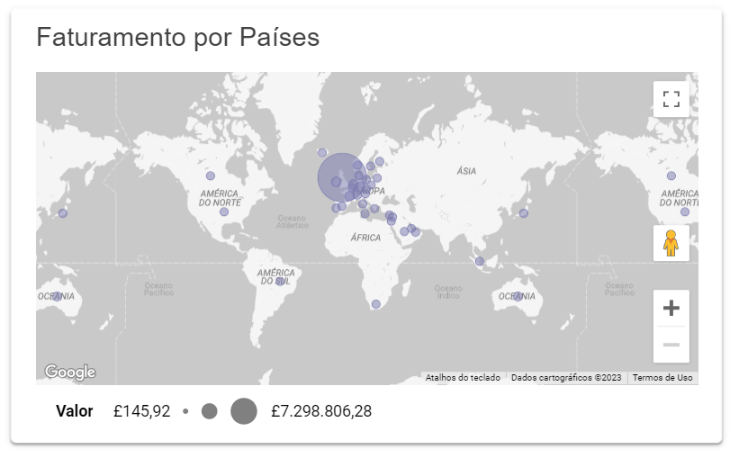

Com isso identificamos países com médias de gastos distintas.

**Faturas Geradas por Mês:**

- Criamos uma nova coluna "ANO - MÊS" a partir da coluna "Data da fatura".

    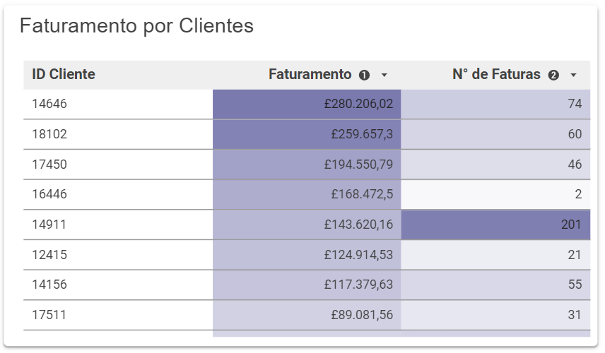
- Geramos uma tabela dinâmica que mostrou o número de faturas emitidas por mês.

    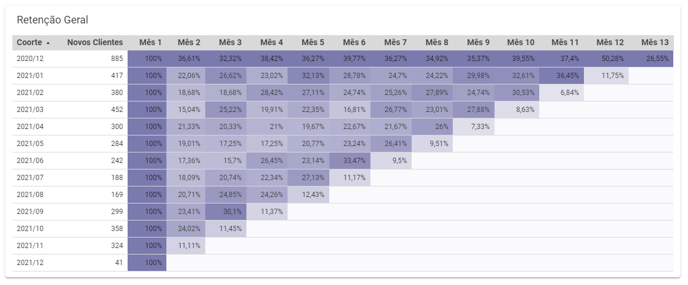

- Em seguida criamos um gráfico para visualizar a tendência de faturas ao longo do tempo.

    

**Número de Faturas do Reino Unido versus Estrangeiras por Mês:**

- Criamos uma nova coluna "Pertence ao Reino Unido?" usando a formula:
    ```
    =SE(PAÍS="Reino Unido";"SIM";"NÃO")
    ```

    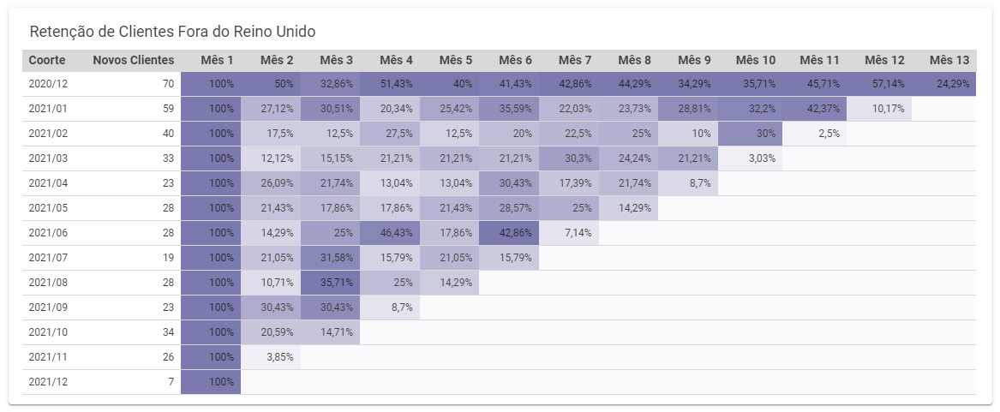
    
- Geramos uma tabela dinâmica que contou o número de faturas para clientes do Reino Unido e clientes estrangeiros.

    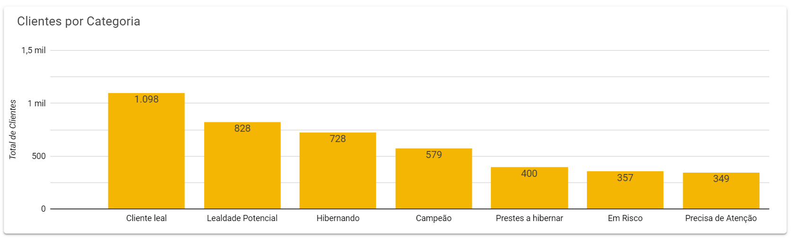

Então criamos um gráfico de série cronológica para comparar as vendas entre esses dois grupos.
    

**Número de Novos Clientes por Mês:**

- Criamos uma tabela dinâmica que utilizou meses-anos como linhas e calculou o número de clientes únicos.

    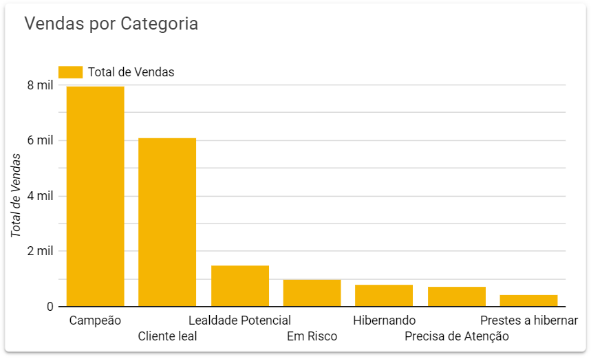

- Utilizamos a coluna de ID de Cliente para contar clientes exclusivos.

    

- Com isso criamos um gráfico para analisar se o aumento nas faturas estava relacionado ao aumento de novos clientes.

    

### Medição do Engajamento do Cliente com Análise de Coorte


Replicar os Dados em Outra Aba e Criar a Coluna Coorte:

- Copiamos os dados para outra aba usando a função Query.
- Adicionamos uma coluna "Coorte" para armazenar a data de entrada de cada cliente, que corresponde à sua primeira data de compra.
- Utilizamos a função PROCV no conjunto de dados original para encontrar a data de entrada de cada cliente, garantindo que seja a primeira data de compra.

Criar Tabela Dinâmica:

- Criamos uma tabela dinâmica em que as linhas representam as coortes, as colunas representam as datas no formato ano-mês e os valores indicam o número de clientes únicos que fizeram compras nesses meses.
- Optamos por contar clientes únicos, pois o objetivo é determinar se um cliente fez uma compra em um determinado mês, independente do número de compras realizadas.

Transformar Tabela Dinâmica em Análise por Mês:

- Movemos todas as coortes para começarem na primeira coluna, utilizando a função QUERY, PROCV, LINS, COLS ou ajustes manuais.
- Renomeamos as colunas como "Mês 1", "Mês 2" e assim por diante.
- Calculamos a porcentagem de clientes que continuam a fazer compras em cada mês, dividindo os números pelos clientes que começaram.
- Aplicamos formatação condicional para visualizar as taxas de retenção e perda de clientes.

É importante ressaltar que, após a análise de coorte, consideramos a possibilidade de replicar o processo para determinar a retenção de clientes do Reino Unido e de outros países. Isso pode ser feito aplicando filtros na tabela dinâmica ou nos dados copiados. Comparar as retenções entre diferentes grupos é valioso para entender o comportamento do cliente em diversos contextos de vendas online. Certificamo-nos de que as porcentagens de retenção são comparadas adequadamente, levando em conta a natureza específica do negócio e do setor em questão.

### Segmentação de Clientes com Metodologia RFM

Preparar um Novo Conjunto de Dados:

- Criamos uma nova aba para copiar apenas as colunas relevantes do conjunto de dados original.
Selecionamos as colunas necessárias, que incluem as datas de compra, número de faturas, valor total gasto e o ID do cliente.
- Criamos uma tabela dinâmica para listar todos os clientes, incluindo informações sobre a última data de compra, o número de faturas associadas a cada cliente e o valor total gasto.

Categorizar os Clientes com Base em Quartis:
- Calculamos a recência para cada cliente, medindo o tempo decorrido desde sua última compra em dias.
- Definimos os limites dos quartis para Recência, Frequência de Faturas e Valor Monetário usando a função QUARTIL.
- Categorizamos os clientes em quartis com base em Recência, Frequência e Valor Monetário usando a função IFS, identificando em qual intervalo de quartil cada cliente se encaixa.

Análise:

- Analisamos os resultados da categorização de clientes em quartis de Recência, Frequência e Valor Monetário.
- Exploramos diferentes categorizações, como os melhores clientes (RFM=144), clientes leais (RFM=X4X), clientes que mais pagam (RFM=XX4), clientes fiéis (RFM=X41, RFM=X42), novos clientes (RFM=11X) e dormentes (RFM=44X).
- Utilizamos essas categorias para identificar estratégias de marketing e recomendações para o UK Merch, como direcionar esforços de marketing para clientes dormentes e criar campanhas direcionadas com base na segmentação.
- Consideramos a possibilidade de segmentar os clientes com base em sua localização no Reino Unido ou fora dele para adaptação de estratégias publicitárias.


Essas etapas nos permitiram segmentar os clientes do UK Merch com base em Recência, Frequência e Valor Monetário, criando categorias que ajudam a direcionar esforços de marketing e maximizar a receita. A segmentação fornece insights valiosos para tomar decisões estratégicas eficazes.

## Visualização

A baixo os visuais recomendados para que os gestores e colaboradores da empresa possam acompanhar as métricas discutidas nesse preojeto:


### Página com Informações de Vendas e Indicadores importantes para a empresa sobre faturamento e total de vendas:

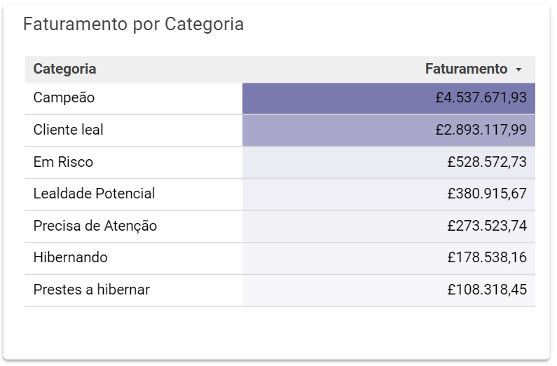
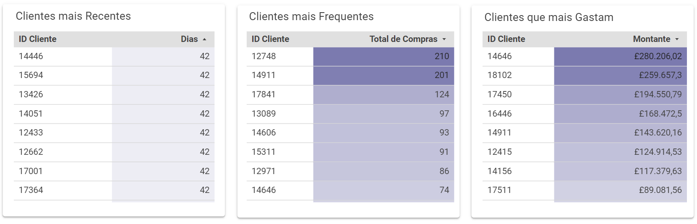

### Página com apresentação de indicadores de retenção da UK Merch:


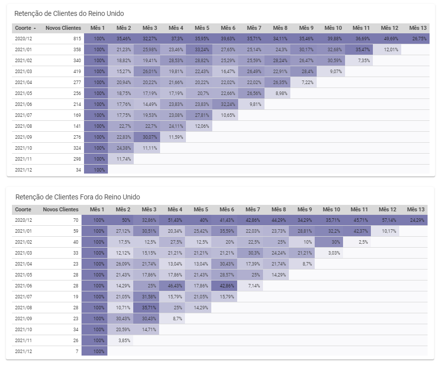

### Página com apresentação de indicadores e segmentação dos clientes da UK Merch baseada na metodologia RFM:


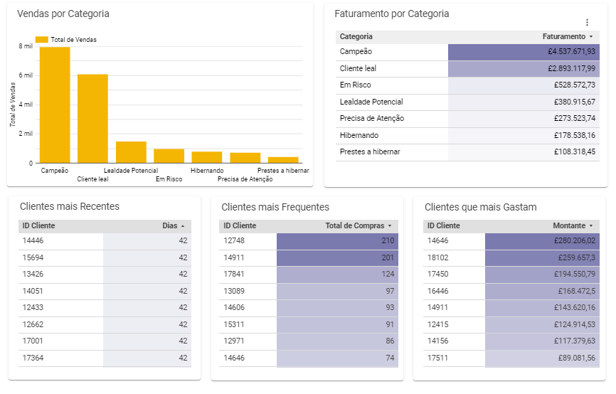

## 💡 Resultados

A partir dessas análises podemos identificar:
- O ticket médio da UK Merch é de £480,18;
- A empresa teve operções em 37 páises;
- O mês de melhor performance da emprese é Novembro, tanto em número de vendas faturadas, quanto em valor da vendas;
- O segundo mês de relacionamento com os clientes do Reino Unido é o que tem menor taxa de retenção;
- Para os clientes fora do Reino Unido o mês 9 de relacionamento é o que apresenta a menor taxa de retenção;
- A UK Merch tem um número significativos de clientes leais e com lealdade potencial, poderiam ser implementadas ofrtas para que os tornem clientes campeões.

Os resultados podem ser visualizados no seguinte relatório [UK Merch - Vendas, Segmentação e Retenção de Clientes](https://lookerstudio.google.com/reporting/0a84786a-7bc8-4e28-99ed-a0032aabafa1)