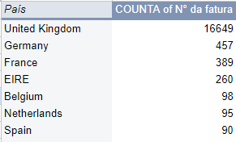
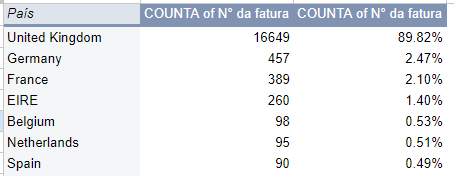
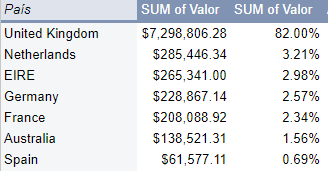
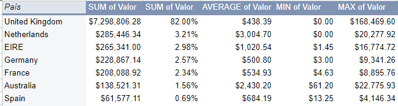
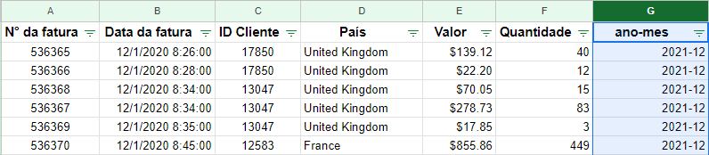
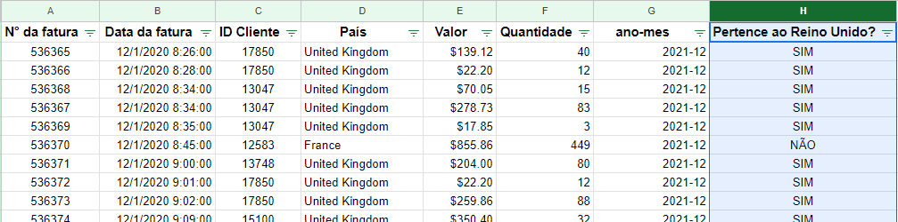
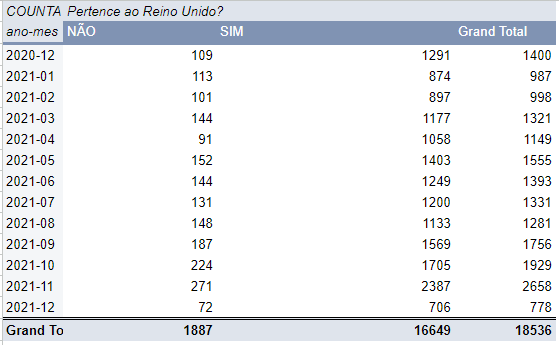
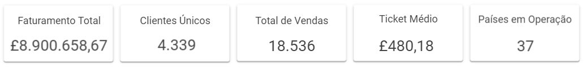
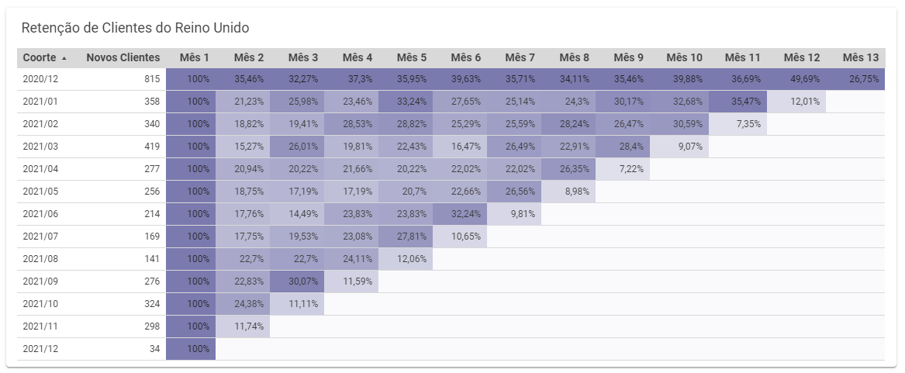

# Projeto de Otimização Estratégica na UK Merch: Integrando Análise de Dados para Potencializar Vendas, Retenção de Clientes e Eficiência Operacional


## Descrição do Problema:

A UK Merch, uma empresa de varejo de vestuário no atacado, enfrenta desafios significativos em entender e otimizar seu desempenho de negócios. A falta de dados e estratégias claras impacta diretamente suas operações e decisões. Os principais problemas identificados são:

**Falta de Visibilidade nas Vendas:** A empresa não possui uma compreensão clara de suas métricas de vendas mensais, padrões sazonais, e os países que contribuem significativamente para o volume de vendas.

**Ausência de Estratégias Segmentadas:** A UK Merch adota uma abordagem única para todos os clientes, sem segmentação efetiva. Isso resulta em gastos ineficientes de recursos e esforços de marketing.

**Dificuldade em Medir a Retenção de Clientes:** A falta de métricas claras para medir a retenção de clientes dificulta a avaliação do impacto da expansão para outros países.

**Uso Ineficiente de Recursos:** Suspeita-se que a empresa esteja gastando recursos de maneira inadequada, sem foco estratégico. Isso pode ser otimizado para maximizar os lucros.

## Objetivos

- ### Revisão da Qualidade dos Dados:

Identificar e corrigir problemas de qualidade nos dados, como ausências, duplicatas e valores inconsistentes.

- ### Análise Descritiva de Vendas:

Construir um dashboard que forneça uma visão abrangente das métricas de negócios, incluindo vendas mensais, países de destaque, clientes principais e padrões de compra.

- ### Análise de Coorte para Medir Retenção:

Aplicar análise de coorte para medir a retenção de clientes, distinguindo entre clientes do Reino Unido e internacionais.

- ### Segmentação de Clientes com Metodologia RFM:

Utilizar a abordagem RFM para segmentar clientes com base em Recência, Frequência e Quantidade, identificando grupos estratégicos.

## Limpeza e preparação dos dados

### Detecção de nulos ou vazios

Uma forma rápida de diagnosticar se o conjunto de dados possui valores vazios é utilizar a função “=CONTAR.VAZIO()” ou "=COUNTBLANK()". Esta função percorre cada valor do intervalo e conta o número de registros vazios encontrados.

Para esse projeto os registros com valores nulos foram deletados pois eram poucos significativos para a análise.

### Detecção e remoção de dados duplicados

Para remover dados duplicados, usamos a função Remover cópias (Dados > Limpeza de dados > Remover cópias). Com foco em na coluna fatura pois elá é o idendifcador e deve ser único em cada registro de venda.


### Detecção e eliminação de quantidades negativas

Existem valores negativos mas nesse caso não são necessariamente incorretos. Pois nos registros das vendas as faturas que começam com a letra C correspondem a devoluções e podemos assumir que a isso se devem os valores negativos (a venda é positiva, a devolução é negativa).


Como só queremos analisar as vendas do negócio (e não as devoluções), devemos remover esses valores do nosso conjunto de dados. Para isso, você pode usar filtros, em particular a opção **"Filtrar por condição"**, e depois remover as linhas com valores negativos.


## Análise exploratoria

### Análise das Vendas

Análise do Número de Faturas por País:

- Criamos uma tabela que listou o número de faturas emitidas para cada país.

    

- Calculamos a porcentagem de faturas representada por cada país.

    

- Identificamos os principais países em termos de número de faturas emitidas.


Análise de Valor Total por País:

- Criamos uma tabela que apresentou o valor total de vendas por país.

    

- Calculamos a porcentagem que cada país representou do valor total.

    

- Calculamos o valor médio, mínimo e máximo gasto em cada país.

    

- Identificamos países com médias de gastos distintas.

Faturas Geradas por Mês:

- Criamos uma nova coluna "ANO - MÊS" a partir da coluna "Data da fatura".

    
- Geramos uma tabela dinâmica que mostrou o número de faturas emitidas por mês.

    

- Criamos um gráfico para visualizar a tendência de faturas ao longo do tempo.

Número de Faturas do Reino Unido versus Estrangeiras por Mês:

- Criamos uma nova coluna "Pertence ao Reino Unido?" usando a formula:
    ```
    =SE(PAÍS="Reino Unido";"SIM";"NÃO")
    ```

    
    


- Geramos uma tabela dinâmica que contou o número de faturas para clientes do Reino Unido e clientes estrangeiros.

    

- Criamos um gráfico de série cronológica para comparar as vendas entre esses dois grupos.

Número de Novos Clientes por Mês:

- Criamos uma tabela dinâmica que utilizou meses-anos como linhas e calculou o número de clientes únicos.

    

- Utilizamos a coluna de ID de Cliente para contar clientes exclusivos.

- Criamos um gráfico para analisar se o aumento nas faturas estava relacionado ao aumento de novos clientes.

### Medição do Engajamento do Cliente com Análise de Coorte

### Segmentação de Clientes com Metodologia RFM

## 📊 Visualização
Indicadores de desenpenho da empresa:






## 💡 Resultados

Os resultados podem ser visualizados no seguinte relatório [UK Merch - Vendas, Segmentação e Retenção de Clientes](https://lookerstudio.google.com/reporting/0a84786a-7bc8-4e28-99ed-a0032aabafa1)